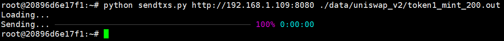
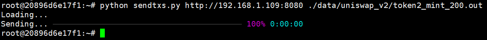

# Uniswap v2 Test Scripts

- [Uniswap v2 Test Scripts](#uniswap-v2-test-scripts)
  - [1. Introduction](#1-introduction)
  - [2. Deploy the Core](#2-deploy-the-core)
  - [3. Mint Tokens](#3-mint-tokens)
    - [3.1. Mint the First Token](#31-mint-the-first-token)
    - [3.2. Mint the Second Token](#32-mint-the-second-token)
  - [4. Approve Tokens](#4-approve-tokens)
    - [4.1. The First Token](#41-the-first-token)
    - [4.2. The Second Token](#42-the-second-token)
  - [5. Add to the Liquidity Pool](#5-add-to-the-liquidity-pool)
  - [6. Start Token Swap](#6-start-token-swap)

## 1. Introduction

Uniswap is one of the most popular DeFi application on the Ethereum platform. This example shows how to run the **orignial Uniswap v2** (No change made) on Arcology using the test scripts included in the Ammolite client docker.

If you would like to know more about how to dowload and compile the contracts yourself, please go back to the [main document](./README.md)

> Please make sure you have access to the ammolite docker container and it is successfully connected to a testnet node before you start.

## 2. Deploy the Core

If the Testnet node IP address is `https://192.168.1.103:8080`, **in the [client docker container](https://github.com/arcology-network/benchmarking/ammolite-client-docker.md),** run the following command under the root direct to deploy the contracts to the testnet.
> Note: The port `8080` is reserved for client communication.

```sh
cd uniswap
python deploy.py http://192.168.1.103:8080 134aea740081ac7e0e892ff8e5d0a763ec400fcd34bae70bcfe6dae3aceeb7f0
```

## 3. Mint Tokens

### 3.1. Mint the First Token


```sh
python sendtxs.py http://192.168.1.103:8080 data/uniswap_v2/token1_mint_200.out
```



### 3.2. Mint the Second Token

```sh
python sendtxs.py http://192.168.1.103:8080 data/uniswap_v2/token2_mint_200.out
```



## 4. Approve Tokens

### 4.1. The First Token

```sh
python sendtxs.py http://192.168.1.103:8080 data/uniswap_v2/token1_approve_200.out
```

### 4.2. The Second Token

```sh
python sendtxs.py http://192.168.1.103:8080 data/uniswap_v2/token2_approve_200.out
```

## 5. Add to the Liquidity Pool

```sh
python sendtxs.py http://192.168.1.103:8080 data/uniswap_v2/add_liquidity_200.out
```

## 6. Start Token Swap

```sh
python sendtxs.py http://192.168.1.103:8080 data/uniswap_v2/swap_200.out
```

